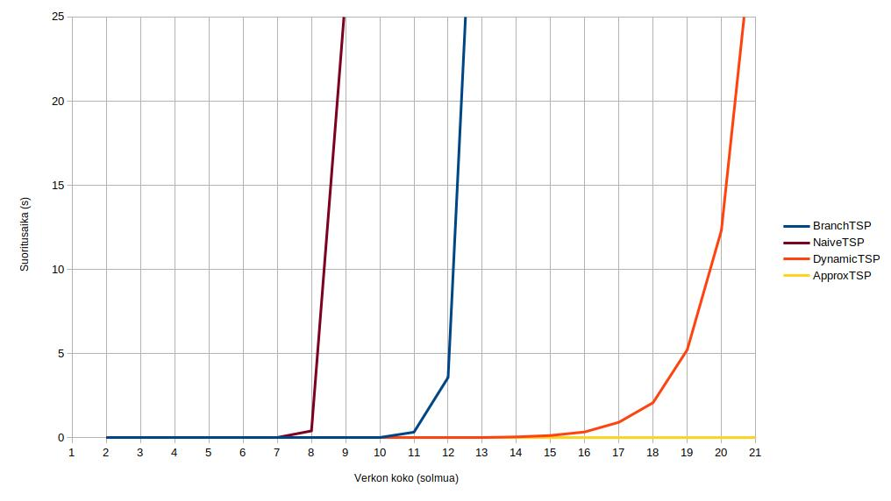
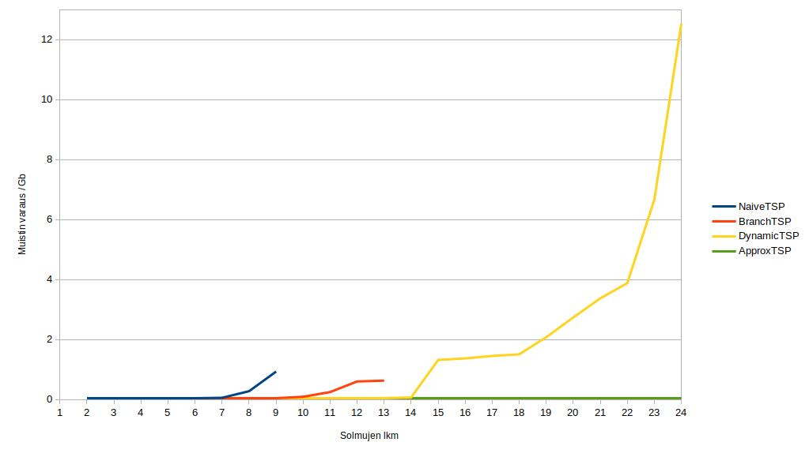

# Suorituskyky

Kaikki testit suoritettiin koneella, jossa prosessorina i5-8265U @ 1.60Ghz x 4, muistia 16gb, käyttöjärjestelmänä Linux (Ubuntu).

## Testaus satunnaisesti generoiduilla verkoilla 

Testaukset suoritettiin satunnaisesti generoiduilla yksisuuntaisilla verkoilla, joissa kaarien paino on satunnainen liukuluku välillä 0-100. 
Algoritmit ajettiin useaan kertaa jokaista verkon kokoa kohti: ennen algoritmin ajoa generoitiin aina uusi satunnainen verkko. Ajojen lukumäärä riippui suoritusajasta: pienille verkoille algoritmi ajettiin 10 kertaa. Jos suoritusaika oli yli viisi sekuntia, ajettiin 5 kertaa, jos yli 30 sekuntia, vain kerran. Verkkojen suoritusajoista otettiin keskiarvo.

Satunnaisen verkon suorituskykytestit ajetaan komentoriviltä algoritmille seuraavasti:

```
./gradlew run --args "runPerformanceTest [algoritmi] [aloitusverkkokoko] [maksimiverkkokoko] [toistot per verkkokoko]" --console=plain

Esim.

./gradlew run --args "runPerformanceTest naive 2 8 10" --console=plain
```

Jos ja kun Javan heap-space loppuu kesken (esim. ajettaessa ApproxTSP isoilla verkoilla), voi ohjelman pakata jariksi ja kekomuistivarausta kasvattaa (tässä 6 gigaa):
```
./gradlew jar
java -Xmx6g -jar ./build/libs/travelleri.jar runPerformanceTest dynamic 20 23 1
```

Jarista ajamalla ohjelma saattaa toimia myös hieman nopeammin.

### Tulokset

| Solmujen lkm | NaiveTSP suoritusaika (ns) | BranchTSP suoritusaika (ns) | DynamicTSP suoritusaika (ns) | ApproxTSP suoritusaika (ns) |
|---|---|---|---|---|
| 2  | 4777        | 37949       | 6618        | 1450 |
| 3  | 2493        | 3050        | 6511        | 1270 |
| 4  | 7927        | 10759       | 15654       | 1356 |
| 5  | 43447       | 36094       | 38547       | 2142 |
| 6  | 397618      | 63505       | 67374       | 2472 |
| 7  | 11213647    | 287946      | 84531       | 4021 |
| 8  | 404999348   | 1516081     | 211324      | 3670 |
| 9  | 26299607848 | 4358703     | 511233      | 4246 |
| 10 |             | 29974455    | 1296410     | 4289 |


| Solmujen lkm | NaiveTSP suoritusaika (s) | BranchTSP suoritusaika (s) | DynamicTSP suoritusaika (s) | ApproxTSP suoritusaika (s) |
|---|---|---|---|---|
| 10 |  | 0.029974  | 0.001296  | 0.000004 |
| 11 |  | 0.329768  | 0.003543  | 0.000003 |
| 12 |  | 3.579601  | 0.008429  | 0.000001 |
| 13 |  | 45.634821 | 0.019947  | 0.000001 |
| 14 |  |           | 0.047579  | 0.000001 |
| 15 |  |           | 0.131301  | 0.000001 |
| 16 |  |           | 0.342394  | 0.000002 |
| 17 |  |           | 0.918363  | 0.000002 |
| 18 |  |           | 2.081705  | 0.000008 |
| 19 |  |           | 5.222039  | 0.000003 |
| 20 |  |           | 12.325517 | 0.000003 |
| 21 |  |           | 31.407858 | 0.000003 |
| 22 |  |           | 80.750790 | 0.000003 |
| 23 |  |           | 187.242918 | 0.000003 |
| 24 |  |           | 332.882166 | 0.000003 |


Huomataan, että DynamicTSP on huomattavasti nopein optimipolun tuottavista algoritmeista. Alle 7 solmun verkoista kevyempää tietorakennetta käyttävät algoritmin ovat hieman nopeampia, mutta ei niin paljoa, että sillä olisi käytännön merkitystä.

BranchTSP selviytyy kohtuullisessa ajassa 12 solmun verkoista, jonka jälkeen se hidastuu merkittävästi. Naive ei toimi järkevässä ajassa enää 8 solmun jälkeen.

DynamicTSP:ssä jokaisen lisäsolmun kohdalla suoritusaika noin kaksinkertaistuu. DynamicTSP toimi vielä ainakin 24 solmulla, mutta alkaa olla jo aika hidas mihinkään käyttötarkoitukseen.

ApproxTSP:lle ei ole solmujen määrällä niinkään merkitystä suoritusaikaan - toisaalta se ei myöskään palauta optimipolkua. Kuitenkin yli 20 solmun verkoissa ApproxTSP alkaa olla näistä algoritmeista ainut käyttökelpoinen algoritmi.



## Muistin käyttö

Muistin käytön mittaaminen käytännössä suorituksen aikana osoittautui ongelmalliseksi johtuen Javan roskienkerääjän arvaamattomasta toiminnasta.
Algoritmien muistinkäytöstä sai kuitenkiun jonkinlaisen kuvan tarkkalemalla käyttöjärjestelmätasolla, kuinka paljon Java-prosessi vei enintään käyttömuistia suorituksen aikana.
Esimerkiksi testikoneella, jossa on Ubuntu 18.04, sai prosessin muistin käytön "peak-value" näkyviin (tässä suoritetaan BranchTSP 10 solmun verkolla)

```
/usr/bin/time -v java -jar ./build/libs/travelleri.jar runPerformanceTest branch 10 10 1 |& grep Maximum

```

Tässä käytetyt testit voi ajaa myös skriptistä

```
./memorytest.sh
```
### Java-prosessin muistin käyttö, kb
| Solmujen lkm | NaiveTSP | BranchTSP | DynamicTSP | ApproxTSP |
|--------------|----------|-----------|------------|-----------|
| 2            | 45896    | 46064     | 47164      | 46156     |
| 3            | 46208    | 46296     | 46872      | 46264     |
| 4            | 45904    | 46316     | 47360      | 46068     |
| 5            | 46048    | 46548     | 46812      | 46172     |
| 6            | 46440    | 46448     | 46864      | 46264     |
| 7            | 61016    | 46880     | 47208      | 45948     |
| 8            | 281080   | 47468     | 47032      | 46240     |
| 9            | 934776   | 54124     | 47172      | 46184     |
| 10           |          | 94516     | 47288      | 45928     |
| 11           |          | 252240    | 51024      | 46444     |
| 12           |          | 605464    | 53304      | 46148     |
| 13           |          | 631908    | 59968      | 45920     |
| 14           |          |           | 72852      | 46476     |
| 15           |          |           | 1322956    | 45856     |
| 16           |          |           | 1373452    | 46136     |
| 17           |          |           | 1455788    | 46104     |
| 18           |          |           | 1507904    | 46060     |
| 19           |          |           | 2079440    | 46516     |
| 20           |          |           | 2736608    | 46216     |
| 21           |          |           | 3374672    | 46252     |
| 22           |          |           | 3881528    | 46136     |
| 23           |          |           | 6661624    | 46012     |
| 24           |          |           | 12530180   | 46728     |

Kuten arvata saattaa, vie DynamicTSP järkyttävästi muistia taulukoinnin käytön vuoksi isoilla verkoilla. Yllättäen DynamicTPS:n muistivaativuus näyttäisi olevan samaa luokkaa muiden algoritmien kanssa myös pienemmillä verkoilla. Kuutta solmua suuremmilla verkoilla NaiveTSP ja BranchTSP jäävät taakse nopeutensa lisäksi muistin käytössä.

DynamicTSP:llä 24 solmun kohdalla tuli jo testikoneen käyttömuistin (16gb) rajat vastaan. Muistin sivutuksesta johtuvasta hidastumisesta ja suoritusajan kasvusta johtuen ei tällä toteutuksella ole enää mielekästä ratkoa tätä suurempia verkkoja, ainakaan tällä koneella.

ApproxTSP:llä ei ole suurempia muistivaatimuksia.

### Java-prosessin muistin käyttö, Gb



Syy DynamicTSP:n muistin käytön harppaukselle yli 14 solmun kohdalla on nähtävissä koodista - 14 suuremmille verkoille DtspMemo:ssa varataan mahdollisimman suuri hash-taulukko, joka vielä toimii (vähemmän törmäyksiä, suorituskykyetu).

## ApproxTSP:n polun pituus vs. optimipolku

### Satunnaisverkot
| Solmujen lkm | ApproxTSP:n polun pituus % optimipolusta (keskimäärin) |
|---|---|

***kesken***

